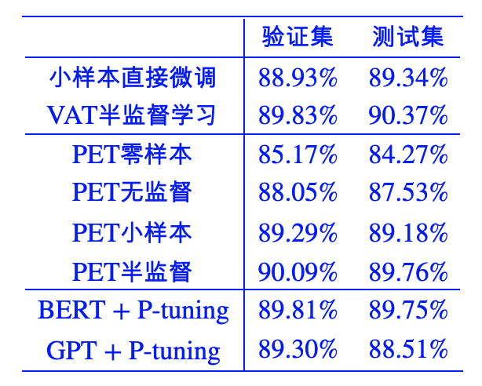

# p-tuning_NLU


## Overview

这个小项目是受乐于分享的苏剑林大佬这篇[p-tuning](https://kexue.fm/archives/8295) 文章启发，也实现了个使用P-tuning进行NLU分类的任务，
思路是一样的，prompt实现方式有不同，这里是将[unused*]的embeddings参数抽取出用于初始化prompt_embed后，再接一个lstm和mlp用于关联各prompt，
与最初p-tuning提出[《GPT Understands, Too》](https://arxiv.org/abs/2103.10385) 的实现一样，结果显示在**few-shot**上p-tuning非常接近finetune效果。


## Dataset

数据是情感分类，下载地址[百度网盘](https://pan.baidu.com/s/1QonWjVp2Ef4Q6JxSbQ_cXg) 提取码：osja


## Evaluation

1. finetune:
```
python few_shot_finetune.py
```
测试集效果：
```
epoch: 0 - acc: 0.897679 - best_test_acc: 0.8976788252013264
epoch: 1 - acc: 0.876362 - best_test_acc: 0.8976788252013264
epoch: 2 - acc: 0.884889 - best_test_acc: 0.8976788252013264
epoch: 3 - acc: 0.884415 - best_test_acc: 0.8976788252013264
epoch: 4 - acc: 0.884415 - best_test_acc: 0.8976788252013264
```
全量参数对小样本进行finetune，仅1个epoch就收敛了

2. p-tuning
```
python few_shot_ptuning.py
```
测试集效果：
```
epoch: 0 - acc: 0.546660 - best_test_acc: 0.5466603505447655
epoch: 1 - acc: 0.687826 - best_test_acc: 0.6878256750355282
epoch: 2 - acc: 0.737091 - best_test_acc: 0.7370914258645191
epoch: 3 - acc: 0.722406 - best_test_acc: 0.7370914258645191
epoch: 4 - acc: 0.776883 - best_test_acc: 0.7768829938417812
epoch: 5 - acc: 0.805306 - best_test_acc: 0.8053055423969683
epoch: 6 - acc: 0.833254 - best_test_acc: 0.8332543818095689
epoch: 7 - acc: 0.837991 - best_test_acc: 0.8379914732354334
epoch: 8 - acc: 0.854571 - best_test_acc: 0.8545712932259593
epoch: 9 - acc: 0.858361 - best_test_acc: 0.8583609663666508
epoch: 10 - acc: 0.856466 - best_test_acc: 0.8583609663666508
epoch: 11 - acc: 0.853150 - best_test_acc: 0.8583609663666508
epoch: 12 - acc: 0.868783 - best_test_acc: 0.8687825675035529
epoch: 13 - acc: 0.877309 - best_test_acc: 0.877309332070109
epoch: 14 - acc: 0.873993 - best_test_acc: 0.877309332070109
epoch: 15 - acc: 0.877783 - best_test_acc: 0.8777830412126955
epoch: 16 - acc: 0.882994 - best_test_acc: 0.8829938417811464
epoch: 17 - acc: 0.881573 - best_test_acc: 0.8829938417811464
epoch: 18 - acc: 0.889626 - best_test_acc: 0.8896257697773567
epoch: 19 - acc: 0.877783 - best_test_acc: 0.8896257697773567
```
仅prompt_embed和lstm及mlp去做p-tuning，20个epoch后接近收敛，acc=0.8896，略小于finetun的acc 0.8977

附上苏神结果对比：


